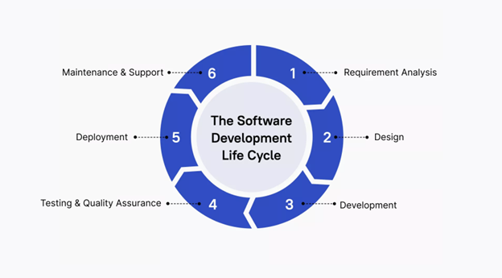

# AI in the Software Development Lifecycle (SDLC)

Let's examine how GitHub Copilot can positively impact each stage of the SDLC:

### Requirement analysis

While GitHub Copilot doesn't directly gather requirements, it can assist in translating requirements into initial code structures:

- **Rapid prototyping:** Quickly generate code snippets based on high-level descriptions, allowing for faster proof-of-concept development.
- **User story implementation:** Transform user stories into initial function or class definitions, providing a starting point for development.
- **API design:** Suggest API structures based on described functionality, helping to flesh out system architectures.

### Design & development

This is where GitHub Copilot truly shines, offering significant productivity boosts:

- **Boilerplate code generation:** Automatically create repetitive code structures, saving time on setup tasks.
- **Design pattern implementation:** Suggest appropriate design patterns based on the problem context, promoting best practices.
- **Code optimization:** Offer more efficient code alternatives, helping developers write performant code from the start.
- **Cross-language translation:** Assist in translating concepts or code snippets between different programming languages.

### Testing & quality assurance

GitHub Copilot can significantly streamline the testing process:

- **Unit test creation:** Generate test cases based on function signatures and behavior, ensuring comprehensive test coverage.
- **Test data generation:** Create realistic test data sets, saving time on manual data creation.
- **Edge case identification:** Suggest test scenarios that cover edge cases, improving the robustness of tests.
- **Assertion suggestions:** Propose appropriate assertions based on the expected behavior of the code being tested.

### Deployment

While not directly involved in deployment processes, GitHub Copilot can assist in related tasks:

- **Configuration file generation:** Help create deployment configuration files for various environments.
- **Deployment script assistance:** Suggest commands or scripts for common deployment tasks.
- **Documentation updates:** Assist in updating deployment documentation to reflect recent changes.

### Maintenance & support

GitHub Copilot proves valuable in ongoing maintenance tasks:

- **Bug fix suggestions:** Propose potential fixes for reported issues based on error messages and surrounding code.
- **Code refactoring:** Suggest improvements to existing code, helping to keep the codebase modern and efficient.
- **Documentation updates:** Assist in keeping code comments and documentation in sync with changes.
- **Legacy code understanding:** Help developers understand and work with unfamiliar or legacy code by providing explanations and modern equivalents.

By involving GitHub Copilot throughout the SDLC, development teams can experience improved efficiency, consistency.

#### Now let's see this in action by [building our first web application using GitHub Copilot](../lesson3/tutor-signup/README.md)