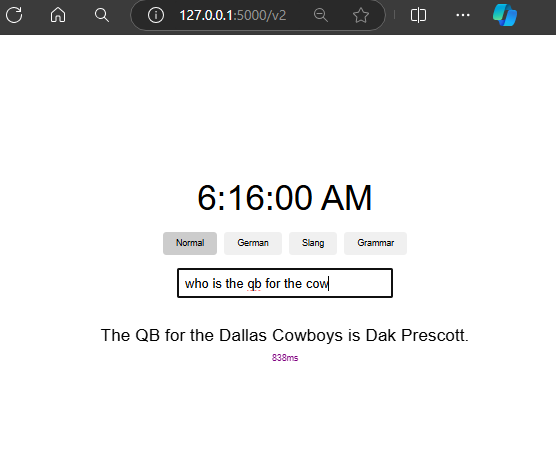

  
# Flask-AzureOpenAI Autocomplete Web App  
   
This project demonstrates how to create an interactive web application using Flask and Azure OpenAI. The application provides autocomplete suggestions based on user input, similar to the example shown in the provided images.  



## Introduction  
   
This project is a sample lesson on integrating Flask with Azure OpenAI to create an interactive web application. The application features:  
- A live clock display  
- Tabs for different modes (non-functional in this example)  
- An input field for user text  
- Autocomplete suggestions based on user input  
- Response time display  

   
## Running the Application  
   
1. **Start the Flask Application**:  `python app.py`  
2. **Access the Application**: Open your browser and go to `http://127.0.0.1:5000`  
3. **Interact with the Application**: Enter text in the input field to see autocomplete suggestions.
4. **Learn to enhance UI with buttons** see `templates/index2.html` for the button code. Go to `http://127.0.0.1:5000/v2` to see the button in action.
5. **View the Response Time**: The response time for the autocomplete suggestions is displayed below the input field.
6. **Stop the Application**: Press `Ctrl+C` in the terminal to stop the Flask application.
   
## Project Structure  
   
```  
flask-autocomplete/  
│  
├── app.py  
└── templates/  
    └── index.html  
    └── index2.html  👈 adv for enchanced UI/UX
```  
   
- `app.py`: The main Flask application file.  
- `templates/`: Directory containing HTML templates.  
- `index.html`: The main HTML file for the web interface.  
- `index2.html`: An advanced version of the HTML file with additional UI elements.
   
