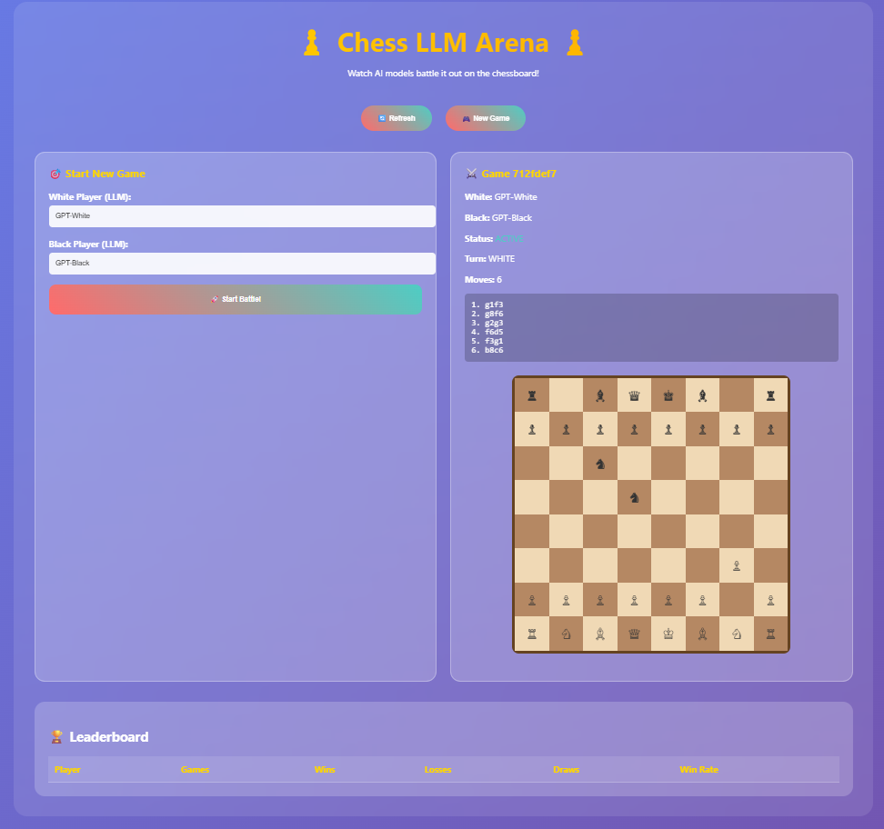

# Chess LLM Arena 🏆♟️

A Flask-based chess tournament application where Large Language Models (LLMs) compete against each other in real-time chess matches. Watch AI models battle it out on the chess board with live tournaments, dynamic leaderboards, and real-time game streaming!



## 🚀 Quick Start

### Agent Mode Recreation (Using GitHub Copilot)

If you're using GitHub Copilot Agent mode, you can recreate this project by following these prompt instructions:

1. **Initial Setup Prompt**:
   ```
   Create a Flask chess application where LLMs play against each other. 
   I need a tournament system with live games, leaderboards, and real-time updates.
   Use Azure OpenAI for the LLM players and python-chess for game logic.
   ```

2. **Core Features Prompt**:
   ```
   Add these features:
   - Tournament management with multiple rounds
   - Different LLM personalities (Aggressive, Defensive, Balanced)
   - Real-time chess board display
   - Live game updates and move streaming
   - Player statistics and ELO ratings
   - Game history and replay functionality
   ```

3. **UI Enhancement Prompt**:
   ```
   Create a modern web interface with:
   - Interactive chess board visualization
   - Live tournament brackets
   - Real-time leaderboard updates
   - Game move history display
   - Player profile cards
   ```

### Manual Setup

1. **Prerequisites**:
   - Python 3.10+
   - Azure OpenAI account with API key
   - VS Code with Dev Container support (optional)

2. **Installation**:
   ```bash
   # Clone or create the project directory
   cd chess-llm-app
   
   # Install dependencies
   pip install -r requirements.txt
   ```

3. **Environment Setup**:
   Create a `.env` file with your Azure OpenAI credentials:
   ```env
   AZURE_OPENAI_ENDPOINT=your_endpoint_here
   AZURE_OPENAI_API_KEY=your_api_key_here
   ```

4. **Run the Application**:
   ```bash
   python chess_app.py
   ```
   
   Or use the VS Code task:
   ```bash
   # In VS Code: Ctrl+Shift+P -> "Tasks: Run Task" -> "Run Chess LLM Arena"
   ```

5. **Access the App**:
   Open your browser and navigate to `http://localhost:5000`

## 🎯 How It Works

### Architecture Overview

```
┌─────────────────┐    ┌─────────────────┐    ┌─────────────────┐
│   Flask Web     │    │   Tournament    │    │   LLM Players   │
│   Interface     │◄──►│   Manager       │◄──►│   (Azure AI)    │
└─────────────────┘    └─────────────────┘    └─────────────────┘
         │                       │                       │
         ▼                       ▼                       ▼
┌─────────────────┐    ┌─────────────────┐    ┌─────────────────┐
│   Real-time     │    │   Game Engine   │    │   Chess Logic   │
│   Updates       │    │   (python-chess)│    │   & Validation  │
└─────────────────┘    └─────────────────┘    └─────────────────┘
```

### Core Components

1. **LLM Chess Players** (`chess_app.py`):
   - **Aggressive Player**: Focuses on attacks and tactical plays
   - **Defensive Player**: Prioritizes piece safety and positional play
   - **Balanced Player**: Combines tactical and positional strategies

2. **Tournament System**:
   - Round-robin tournaments with configurable rounds
   - Automatic game scheduling and pairing
   - ELO rating system for player rankings
   - Win/loss/draw tracking

3. **Game Engine**:
   - Built on `python-chess` library
   - Full chess rule validation
   - Move history and game state tracking
   - Algebraic notation support

4. **Real-time Features**:
   - Live game updates without page refresh
   - Real-time move streaming
   - Dynamic leaderboard updates
   - Game progress indicators

### Game Flow

1. **Tournament Creation**: Initialize tournament with selected LLM players
2. **Game Pairing**: Automatic pairing system matches players
3. **Move Generation**: LLMs analyze board position and generate moves
4. **Move Validation**: Chess engine validates and executes moves
5. **Game Completion**: Results are recorded and ratings updated
6. **Leaderboard Update**: Real-time ranking updates

## 🎮 Features

### Current Features ✅

- **Multi-LLM Support**: Different AI personalities and strategies
- **Tournament Management**: Create and manage chess tournaments
- **Real-time Chess Board**: Visual chess board with live updates
- **Player Statistics**: ELO ratings, win/loss ratios, game history
- **Move History**: Complete game replay functionality
- **Responsive UI**: Works on desktop and mobile devices

### Game Controls

- **Start Tournament**: Begin a new tournament with selected players
- **View Games**: Watch live games in progress
- **Leaderboard**: See current rankings and statistics
- **Game History**: Replay previous games move by move
- **Auto-play**: Games run automatically with AI making moves
- **Multiple Games**: Run multiple games simultaneously

## 🚀 Quick Start

1. **Install Dependencies**:
   ```bash
   pip install -r requirements.txt
   ```

2. **Set up Environment Variables**:
   - Copy `.env-sample` to `.env`
   - Add your Azure OpenAI credentials:
     ```
     AZURE_OPENAI_ENDPOINT="your-endpoint"
     AZURE_OPENAI_API_KEY="your-api-key"
     ```

3. **Run the Application**:
   ```bash
   python chess_app.py
   ```

4. **Open in Browser**:
   Visit `http://localhost:5000`

## 🎮 How to Use

### Web Interface
- **Start New Game**: Enter player names and click "Start Battle!"
- **Watch Live**: Games update automatically every 5 seconds
- **View Leaderboard**: See win rates and statistics
- **Multiple Games**: Start multiple games simultaneously

### Tournament Mode
```bash
python tournament_manager.py --mode tournament --players GPT-Magnus GPT-Kasparov GPT-Fischer GPT-Tal
```

### Quick Battle
```bash
python tournament_manager.py --mode battle --player1 GPT-Alpha --player2 GPT-Beta
```

### Monitor Existing Games
```bash
python tournament_manager.py --mode monitor --duration 120
```

## 🔧 Testing

Run the test suite:
```bash
python test_chess.py
```

## � API Endpoints

- `GET /` - Main web interface
- `POST /start_game` - Start a new game
- `GET /game/<game_id>` - Get game details
- `GET /leaderboard` - Get current leaderboard
- `POST /tournament` - Start a tournament

## 🎨 Features

- **Real-time Updates**: Web interface refreshes automatically
- **Chess Visualization**: ASCII chess board representation
- **Move History**: Track all moves in each game
- **Game Status**: See current turn, game status, and results
- **Win/Loss Tracking**: Comprehensive leaderboard system
- **Concurrent Games**: Multiple games can run simultaneously

## 🏆 Tournament System

The tournament system supports:
- Round-robin tournaments
- Multiple rounds
- Automatic game management
- Live leaderboard updates
- Win rate calculations

## 🎯 Example Players

Create interesting matchups with themed player names:
- `GPT-Magnus` vs `GPT-Kasparov`
- `GPT-Fischer` vs `GPT-Tal`
- `GPT-Alpha` vs `GPT-Beta`
- `GPT-Warrior` vs `GPT-Strategist`

## 🔥 Let Them Fight!

"it lets LLMs play chess against each other live - we can run full tournaments, follow live games, and watch the leaderboard go wild - let them fight" 

Enjoy watching AI models battle it out on the chessboard! 🎮♟️
## Environment Variables and API Keys

This project uses environment variables to securely store sensitive information, such as your Azure OpenAI API keys. Here’s how to set it up:

1. **Copy the Sample File:**  
   Duplicate the `.env-sample` file and rename the copy to `.env` in the project root directory.

2. **Add Your API Keys:**  
   Open the new `.env` file and fill in your actual `AZURE_OPENAI_ENDPOINT` and `AZURE_OPENAI_API_KEY` values.  
   If you don’t have these yet, please visit the [BSMP Loops Azure OpenAI API Keys Documentation](https://m365t91687972.sharepoint.com/:fl:/g/contentstorage/CSP_f355685a-4176-4533-bbd8-2e9db8db89cd/ESS-JvsPHsNDm4rblc2EbIwBHaxRXA4ILDrpjLqzmLPbUw?e=ta1qTn&nav=cz0lMkZjb250ZW50c3RvcmFnZSUyRkNTUF9mMzU1Njg1YS00MTc2LTQ1MzMtYmJkOC0yZTlkYjhkYjg5Y2QmZD1iJTIxV21oVjgzWkJNMFc3MkM2ZHVOdUp6ZVdtRFRXWnV4ZEtxZlZzMHFlYWxjYjd3dzl0VGpOLVJMNkoxdDNuRWtoSyZmPTAxWVhJRkhQSkVYWVRQV0RZNllOQlpYQ1czU1hHWUkzRU0mYz0lMkYmYT1Mb29wQXBwJnA9JTQwZmx1aWR4JTJGbG9vcC1wYWdlLWNvbnRhaW5lciZ4PSU3QiUyMnclMjIlM0ElMjJUMFJUVUh4dE16WTFkRGt4TmpnM09UY3lMbk5vWVhKbGNHOXBiblF1WTI5dGZHSWhWMjFvVmpneldrSk5NRmMzTWtNMlpIVk9kVXA2WlZkdFJGUlhXblY0WkV0eFpsWnpNSEZsWVd4allqZDNkemwwVkdwT0xWSk1Oa294ZEROdVJXdG9TM3d3TVZsWVNVWklVRXRFU2paTFFsSXlUMFJRU2taWlVVdE5WVXhGVGxKRk5FUlclMjIlMkMlMjJpJTIyJTNBJTIyMGYwMDE4ZTQtNmE2YS00MGNjLWI4ZmEtZmIwZDYzYmI0NTY4JTIyJTdE) for instructions on obtaining your keys.

3. **Why is `.env` in `.gitignore`?**  
   The `.env` file is listed in `.gitignore` so that your sensitive keys are not accidentally shared or uploaded to version control systems like GitHub. This helps keep your credentials secure.

### What are Environment Variables?

Environment variables are used to configure your application without hardcoding sensitive information (like API keys) directly in your code. This is a common practice for security and flexibility, especially when working with cloud services and APIs.

If you’re new to this, just follow the steps above and ask your instructor if you have any

----

# Lesson Instructions for coders

## Lesson quick start

all of the lesson code today is in basics folder. so in the termanal to start the frist app do the following

```sh
cd basics
python app1.py
```

### Part 1: Basic Flask App with Multiple Routes

**Objective:** Introduce basic Flask routes and a simple HTML template with buttons, images, and a video.

**app1.py:**
```python
from flask import Flask

app = Flask(__name__)

@app.route('/')
def home():
    return "Hello, this is a basic Flask app!"

@app.route('/page1')
def page1():
    message = "Hello, this is a basic Flask app!"
    return f"""{message}<div></div>
    <button><a href="/test-ai">Test AI</a></button> <br>
    <a href="/test-ai">Test AI</a> <br>
    <a href="/ask">Ask</a> <br>
    <a href="/chat">Chat</a>"""

HTML_TEMPLATE = """
<h1>Hello, this is a basic Flask app!</h1>
<button><a href="/test-ai">Test AI</a></button> <br>
 <br>
<iframe width="560" height="315" src="https://www.youtube.com/embed/CtdyoH-kvog?si=6lEVlWfIBuNhZhxy" title="YouTube video player" frameborder="0" allow="accelerometer; autoplay; clipboard-write; encrypted-media; gyroscope; picture-in-picture; web-share" referrerpolicy="strict-origin-when-cross-origin" allowfullscreen></iframe>
"""

@app.route('/page2')
def page2():
    return HTML_TEMPLATE

if __name__ == '__main__':
    app.run(debug=True)
```


**Explanation:**
- **Multiple Routes:** We have multiple routes (`/`, `/page1`, `/page2`) that return different content.
- **HTML Template:** The `/page2` route uses an HTML template with a button, an image, and a video.


### Part 2: Interactive Echo App with POST Requests

**Objective:** Create an interactive Flask app that handles POST requests and returns responses.

**app2.py:**
```python
from flask import Flask, request, jsonify, render_template_string
import requests

app = Flask(__name__)

HTML_TEMPLATE = '''
<!DOCTYPE html>
<html lang="en">
<head>
    <meta charset="UTF-8">
    <meta name="viewport" content="width=device-width, initial-scale=1.0">
    <title>Interactive Echo App</title>
</head>
<body>
    <h1>Interactive Echo App</h1>
    <form method="POST" action="/send_echo">
        <input type="text" name="message" placeholder="Enter your message">
        <input type="submit" value="Send to Echo Server">
    </form>
    
    <p>{{ result }}</p>
    
</body>
</html>
'''

def send_echo_request(message):
    url = "http://localhost:5000/echo"
    data = {"message": message}
    response = requests.post(url, json=data)
    if response.status_code == 200:
        return f"Server responded: {response.json()['response']}"
    else:
        return f"Error: Status code {response.status_code}"

@app.route('/')
def home():
    return render_template_string(HTML_TEMPLATE)

@app.route('/send_echo', methods=['POST'])
def send_echo():
    message = request.form.get('message', '')
    result = send_echo_request(message)
    return render_template_string(HTML_TEMPLATE, result=result)

@app.route('/echo', methods=['POST'])
def echo():
    data = request.json
    message = data.get('message', 'No message sent')
    return jsonify({'response': message})

if __name__ == '__main__':
    app.run(debug=True)
```

**Explanation:**
- **Interactive Form:** The HTML form sends a message to the Flask server.
- **Echo Endpoint:** The `/echo` endpoint returns the message received.
- **POST Requests:** Handles POST requests and returns JSON responses.

**Running the Apps:**
- Open two terminals.
- In the first terminal, run `python app2.py` to start the Flask server.
- In the second terminal, use the script below to send test messages.

**test_app2.py:**
```python
from app2 import send_echo_request

# Test the echo endpoint
print(send_echo_request("Hello, Flask!"))
print(send_echo_request("Say Phillip in French!"))
```

### Part 3: Azure OpenAI Chat Model Integration

**Objective:** Integrate Azure OpenAI for advanced chat features.

**app3.py:**
```python
from flask import Flask, request, jsonify
from openai import AzureOpenAI
import os
import dotenv

dotenv.load_dotenv()

AOAI_ENDPOINT = os.getenv("AZURE_OPENAI_ENDPOINT")
AOAI_KEY = os.getenv("AZURE_OPENAI_API_KEY")
MODEL_NAME = "gpt-35-turbo"

app = Flask(__name__)

openai_client = AzureOpenAI(api_key=AOAI_KEY, azure_endpoint=AOAI_ENDPOINT, api_version="2024-05-01-preview")

@app.route('/')
def index():
    return "Hello, this is a simple Flask server."

@app.route('/chat', methods=['POST'])
def chat():
    data = request.get_json()
    user_input = data.get('user_input', '')
    response = openai_client.chat.completions.create(
        model=MODEL_NAME,
        messages=[
            {"role": "system", "content": "You are a helpful assistant."},
            {"role": "user", "content": user_input}
        ],
        max_tokens=50,
        temperature=0.5
    )
    suggestions = response.choices[0].message.content
    return jsonify({'suggestions': suggestions})

if __name__ == '__main__':
    app.run(debug=True)
```

**Explanation:**
- **OpenAI Integration:** Connect to Azure OpenAI to handle chat requests.

**Running the Apps:**
- Open two terminals.
- In the first terminal, run `python app3.py` to start the Flask server.
- In the second terminal, use the script below to send test messages.

**test_app3.py:**
```python
import requests

def send_chat_request(user_input):
    url = "http://localhost:5000/chat"
    data = {"user_input": user_input}
    response = requests.post(url, json=data)
    if response.status_code == 200:
        print(f"Server responded: {response.json()}")
    else:
        print(f"Error: Status code {response.status_code}")

# Test the chat function
send_chat_request("Say hi in French")
```

**Explanation:**
- **Testing:** Test the chat functionality by sending a request to the Flask server.

### Part 4: Flask App with HTML and OpenAI Integration

**Objective:** Combine Flask, HTML, and OpenAI for a complete interactive web app.

**app4.py:**
```python
from flask import Flask, request, jsonify, render_template
from openai import AzureOpenAI
import os
import dotenv

dotenv.load_dotenv()

AOAI_ENDPOINT = os.getenv("AZURE_OPENAI_ENDPOINT")
AOAI_KEY = os.getenv("AZURE_OPENAI_API_KEY")
MODEL_NAME = "gpt-35-turbo"

app = Flask(__name__)

openai_client = AzureOpenAI(api_key=AOAI_KEY, azure_endpoint=AOAI_ENDPOINT, api_version="2024-05-01-preview")

@app.route('/')
def home():
    return render_template('chat_app4.html')

@app.route('/autocomplete', methods=['POST'])
def autocomplete():
    data = request.get_json()
    prompt = data.get('prompt', '')
    response = openai_client.chat.completions.create(
        model=MODEL_NAME,
        messages=[
            {"role": "system", "content": "You are an autocomplete assistant."},
            {"role": "user", "content": prompt}
        ],
        max_tokens=50,
        temperature=0.5
    )
    suggestions = response.choices[0].message.content
    return jsonify({'suggestions': suggestions})

if __name__ == '__main__':
    app.run(debug=True)
```

**templates/chat_app4.html:**
```html
<!DOCTYPE html>
<html lang="en">
<head>
    <meta charset="UTF-8">
    <meta name="viewport" content="width=device-width, initial-scale=1.0">
    <title>Autocomplete App</title>
    <script>
        async function getAutocomplete() {
            const prompt = document.getElementById('inputText').value;
            const response = await fetch('/autocomplete', {
                method: 'POST',
                headers: {
                    'Content-Type': 'application/json'
                },
                body: JSON.stringify({ prompt })
            });
            const data = await response.json();
            document.getElementById('suggestions').innerText = data.suggestions;
        }
    </script>
</head>
<body>
    <h1>Autocomplete App</h1>
    <div>
        <input type="text" id="inputText" oninput="getAutocomplete()">
        <div id="suggestions"></div

>
    </div>
</body>
</html>
```

**Explanation:**
- **Render Template:** Serves an HTML file for interaction.
- **JavaScript:** Fetches autocomplete suggestions from the Flask server.


# Activities 
### 1. **Explore Flask Routes and Templates**

**Activity:**  
- **Objective:** Understand Flask routes and rendering HTML.
- **Task:** modify `app1.py` by adding new routes that display different types of content, such as text, images, or embedded videos. Encourage them to use different HTML elements and styles.
- **Challenge:** Ask coders to create a simple personal webpage using Flask that includes sections like "About Me," "Projects," and "Contact."

### 2. **Create a Mini Chatbot**

**Activity:**  
- **Objective:** Implement basic chatbot functionality using Flask and Azure OpenAI.
- **Task:** Using `app3.py` as a starting point, have coders create a simple chatbot that can answer questions based on a specific theme, such as history, science, or technology.
- **Challenge:** integrate additional APIs (like a weather API or a news API) to provide dynamic responses based on real-time data.

### 3. (optional) **Interactive Form with Data Validation**

**Activity:**  
- **Objective:** Learn about form handling and data validation in Flask.
- **Task:** In `app2.py`, extend the interactive form to include additional input fields (e.g., name, age, favorite color) and implement basic validation (e.g., required fields, correct data types).
- **Challenge:** Ask coders to store and display submitted data on a new route, creating a simple guestbook application.

### 4. (optional) **Autocomplete Feature Enhancement**

**Activity:**  
- **Objective:** Improve the autocomplete feature using JavaScript and Flask.
- **Task:** In `app4.py` and `chat_app4.html`, modify the autocomplete functionality to provide more interactive suggestions (e.g., highlighting, filtering based on previous inputs).
- **Challenge:** Have coders create a themed autocomplete feature (e.g., suggesting movie titles, book names, or historical figures) and display related images or links based on the user's selection.
