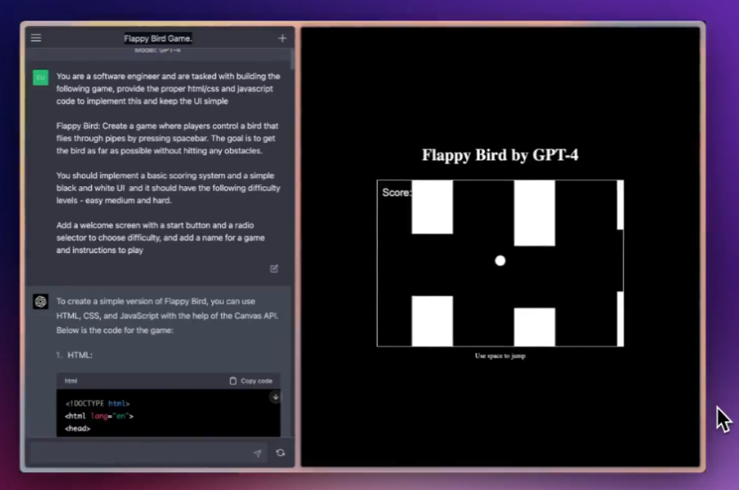

# Lesson 4: Creating a Flappy Bird Game with Flask and GitHub Copilot



## Introduction
In this lesson, we will explore the basics of Flask, a web framework for Python, and demonstrate how to use GitHub Copilot to generate code for an interactive Flappy Bird game. This will highlight the differences between Flask and Streamlit, and show how to leverage Copilot to assist with coding in JavaScript, even if you are not learning JavaScript in this course.

## Objectives
- Understand the basics of Flask and how it compares to Streamlit.
- Use GitHub Copilot to generate and assist with JavaScript code.
- Create an interactive Flappy Bird game with a Flask backend and a JavaScript frontend.
- Make specific modifications to the game using Copilot.

## Prerequisites
- Completion of Lessons 1-3 on Python fundamentals and Streamlit.
- Basic knowledge of HTML and CSS (beneficial but not required).

## Getting Started

### Setting Up Flask
1. **Initialize Flask App**: Set up a basic Flask application structure.
2. **Game Page Route**: Create a route to serve the game's HTML page.
3. **Serve Static Files**: Configure Flask to serve static files (JavaScript, CSS).

### Creating the Game Interface
1. **HTML Page**: Create an HTML file for the game with a canvas element.
2. **Styling**: Use CSS to style the game, focusing on a simple black-and-white theme.

### Implementing Game Logic with JavaScript
1. **Initialize Variables**: Define variables for the bird's position, velocity, gravity, pipes, and score.
2. **Game Loop**: Implement a function to update the game state, move pipes, and check for collisions.
3. **Bird Control**: Add an event listener to control the bird's movement with the spacebar.
4. **Pipe Generation**: Write a function to generate pipes at regular intervals.
5. **Collision Detection**: Implement logic to detect collisions between the bird and pipes.
6. **Score Tracking**: Update and display the score.

## Interacting with GitHub Copilot
GitHub Copilot can assist you in writing code more efficiently. Here’s how to interact with Copilot:

1. **Open Your Code Editor**: Open Visual Studio Code (VSCode) or any other compatible editor.
2. **Start Typing**: Begin typing your code, and Copilot will provide suggestions.
3. **Review Suggestions**: Review and accept suggestions by pressing `Tab` or `Enter`.
4. **Use Prompts**: Guide Copilot by providing clear and specific prompts.

## Implementing the Flappy Bird Game
Use GitHub Copilot to generate the following components by using the given prompt:

```md
You are a software engineer and are tasked with building the following game using Python Flask as the backend and JavaScript for the frontend.

**Game Description:**
Flappy Bird: Create a game where players control a bird that flies through pipes by pressing the spacebar. The goal is to get the bird as far as possible without hitting any obstacles.

**Requirements:**
1. **Backend (Flask):**
   - Set up a basic Flask application.
   - Implement routes for serving the game HTML page and handling any necessary game data.

2. **Frontend (JavaScript):**
   - Create a simple black-and-white UI for the game.
   - Implement the game logic using JavaScript and the Canvas API.
   - Add a scoring system to keep track of the player's score.
   - **Generate and render pipes (obstacles) that the bird must navigate through. Ensure the pipes move from right to left across the screen and are spaced out at regular intervals.**
   - Detect collisions between the bird and the pipes, ending the game if a collision occurs.
   - Implement a game loop that:
     - Initializes the game elements (bird, pipes, score).
     - Draws the bird and pipes on the canvas.
     - Updates the bird's position based on gravity and player input.
     - Handles the generation and movement of pipes.
     - Checks for collisions between the bird and the pipes.
     - Resets the game if a collision occurs or if the bird goes out of bounds.
     - Keeps track of the score and displays it on the screen.
     - Listens for keyboard input (spacebar) to control the bird's movement.

**Instructions:**
   - Use Python Flask to serve the game page and handle backend logic.
   - Use HTML, CSS, and JavaScript to create the game interface and implement the game mechanics.
   - Make the title of the game "BSMP 2024 Coders Flappy Bird Game."
   - Provide the complete code files.
   - Ensure the UI remains simple and user-friendly.
```

## Running the Application
1. **Set Up Flask**:
   - Create and activate a virtual environment.
   - Install Flask using `pip install flask`.
   - Create a Python file (e.g., `app.py`) and use the provided prompt to generate the Flask backend.

2. **Create Frontend Files**:
   - Create an `index.html` file in the `templates` directory using the provided prompt.
   - Create a `game.js` file in the `static` directory using the provided prompt.

3. **Run the Flask Application**:
   - Start the Flask app by running `python app.py`.
   - Open a web browser and navigate to `http://127.0.0.1:5000/` to see the game in action.

## Activities and Modifications
In this section, you will learn how to make changes to the game using GitHub Copilot. These changes will be made to the JavaScript code, so you will practice interacting with Copilot to implement them.

### Activity 1: Increase the Pipe Gap
**Description**: Make the game easier by increasing the gap between pipes.
**Prompt**: Modify the code to increase the gap between pipes to make the game easier.

### Activity 2: Reduce Gravity
**Description**: Make the bird's movement less intense by reducing gravity.
**Prompt**: Adjust the gravity variable to reduce the bird's fall speed.

### Activity 3: Reduce Pipe Speed
**Description**: Slow down the pipes to give the player more reaction time.
**Prompt**: Change the pipe speed to move slower across the screen.

By engaging in these activities, you will see how GitHub Copilot can help you modify and improve your game without needing to know JavaScript in detail.


### Supplemental Resources
- [Visual Studio Code Flask Tutorial](https://code.visualstudio.com/docs/python/tutorial-flask)
- [LaunchCode Flask Introduction](https://education.launchcode.org/lchs/chapters/flask-intro/index.html)
- [LaunchCode First Flask App](https://education.launchcode.org/lchs/chapters/flask-intro/first-flask-app.html)