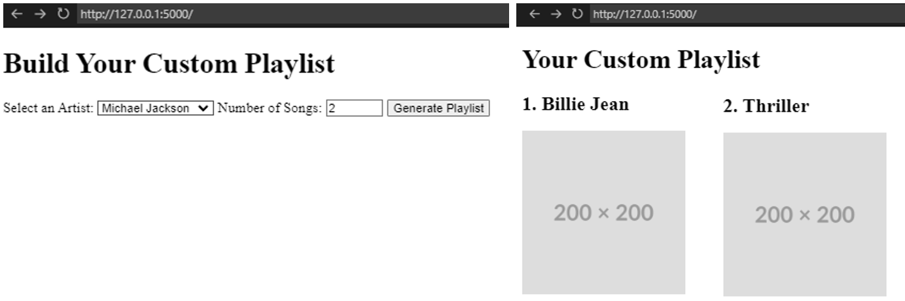

# Playlist App - Flask Version  



## Quick start

```
cd demos/playlist_app
python app.py
```
   
## Introduction  
This Flask version of the Playlist App serves the same purpose as the original Streamlit version: it allows users to build a custom playlist by selecting an artist and specifying the number of songs they want in their playlist.  
   
However, the Flask version differs in several ways:  
   
1. **Framework Structure:** Flask is a micro web framework written in Python. It does not provide advanced functionalities like form validation or database abstraction but is lightweight and easy to work with for simple applications. Streamlit, on the other hand, is an open-source Python library that makes it easy to create custom web apps for machine learning and data science.  
   
2. **User Interface:** In the Flask version, the user interface is created using HTML and CSS, while in the Streamlit version, the user interface is created using Streamlit's own methods.  
   
3. **Data Flow:** In the Flask version, the user's input is sent from the client (browser) to the server (Flask app) via HTTP requests. The server processes this input and sends back a response (the generated playlist), which is then displayed to the user. In the Streamlit version, the data flow is handled by Streamlit itself, so the developer does not have to manually handle HTTP requests or responses.  
   
## HTML Files  
There are two HTML files used in the Flask version of the Playlist App: `home_playlist.html` and `playlist.html`.  
   
`home_playlist.html` is the home page of the app. It contains a form that allows the user to select an artist and specify the number of songs they want in their playlist. When the user submits the form, their input is sent as a POST request to the `/generate` route in the Flask app.  
   
`playlist.html` is the page that displays the user's generated playlist. It receives the playlist data from the Flask app and uses a Jinja2 `for` loop to display each song in the playlist.  
   
## Lists  
Lists are used in several places in the Flask app:  
   
- `artists`: This list contains the names of all available artists.  
- `songs` and `album_covers`: These lists contain the songs and album covers of the selected artist, respectively. They are defined inside the `get_songs_and_covers` function, based on the artist selected by the user.  
- `playlist`: This list contains the songs and album covers that will be in the user's custom playlist. It is created inside the `build_playlist` function, based on the number of songs specified by the user.  
   
## Conclusion  
While the Flask version of the Playlist App is more complex than the Streamlit version, it provides a good introduction to web development with Flask, HTML, and Jinja2. Understanding how data flows in a Flask app and how to use lists and functions in Python will be useful for more advanced web development projects.